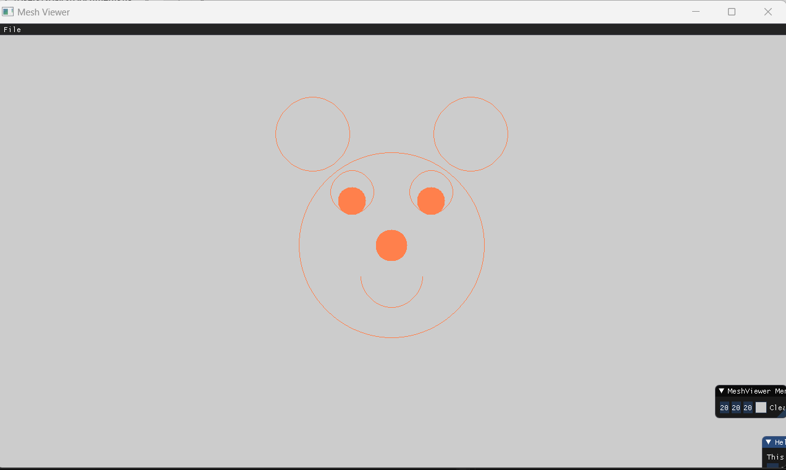

# Our implementation of the algorithm (based on the lecture):

```
void Renderer::DrawLineReversedAxis(int x1, int y1, int x2, int y2, const glm::vec3& color)
{
	int e, dx, dy, reflect = 1;

	dx = x2 - x1;
	dy = y2 - y1;
	if (x1 > x2) // if the slope is negative
		reflect = -1;
	e = -dy;
	while (y1 <= y2) // Bresenham algorithm
	{
		if (e > 0)
		{
			x1 += 1 * reflect;
			e -= 2 * dy;
		}
		PutPixel(x1, y1, color);
		y1 += 1;
		e += 2 * dx * reflect;
	}
}

void Renderer::DrawLine(const glm::ivec2& p1, const glm::ivec2& p2, const glm::vec3& color)
{
	int x1 = 0, x2 = 0, y1 = 0, y2 = 0, e = 0, dx = 0, dy = 0, reflect = 1; // we init some flags
	if (p1.x < p2.x)  // init on base of is p1.x < p2.x
	{
		x1 = p1.x;
		y1 = p1.y;
		x2 = p2.x;
		y2 = p2.y;
	}
	else
	{
		x1 = p2.x;
		y1 = p2.y;
		x2 = p1.x;
		y2 = p1.y;
	}
	dx = x2 - x1; // init delta for x and y
	dy = y2 - y1;
	if (abs(dy) > abs(dx)) // deceiding if need to run the algo. with reversed axis for slopes that are bigger than abs(1)
	{
		if (y1 < y2) // same as we did for p1.x and p2.x above
			DrawLineReversedAxis(x1, y1, x2, y2, color);
		else
			DrawLineReversedAxis(x2, y2, x1, y1, color);
		return;
	}
	if (y1 > y2) // if the slope is negative
		reflect = -1;
	e = -dx;
	while (x1 <= x2) // Bresenham algorithm
	{
		if (e > 0)
		{
			y1 += 1 * reflect;
			e -= 2 * dx;
		}
		PutPixel(x1, y1, color);
		x1 += 1;
		e += 2 * dy * reflect;
	}
}
```
## Sanity check:


## Let's put some flowers (for creativity):


## A friendly Face




