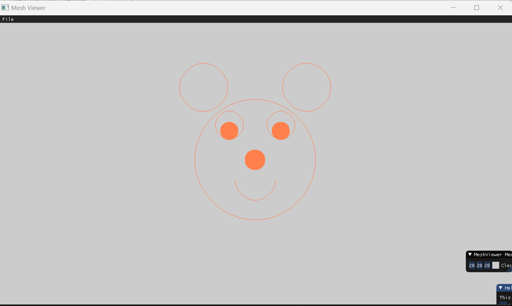

<<<<<<< HEAD


void Renderer::DrawLine(const glm::ivec2& p1, const glm::ivec2& p2, const glm::vec3& color)
{


		int	x0 = p1.x, x1 = p2.x, y0 = p1.y, y1 = p2.y; 
		const int distanceY = -abs(y1 - y0), distanceX = abs(x1 - x0);
		const int setX = x0 < x1 ? 1 : -1; //set the direction for the line
		const int setY = y0 < y1 ? 1 : -1; //set the direction for the line
		int error = distanceX + distanceY;
		bool flagX ,flagY;
		flagX = x0 != x1 ? false : true;
		flagY = y0 != y1 ? false : true;
		while (!flagX||!flagY) // while the line isn't at p2
		{
			PutPixel(x0, y0, color);
				int e2 = 2 * error;
				if (e2 >= distanceY) { 
					if (!flagX)
					{
						error += distanceY;
						x0 += setX;
					}
				}
				else
				{
					if (e2 <= distanceX)
					{
						if (!flagY)
						{
							error += distanceX;
							y0 += setY;
						}
					}
				}
			if (x0 == x1) flagX = true;
			if (y0 == y1) flagY = true;
		}
}


void Renderer::Render(const Scene& scene)
{
	
	const int x0 = viewport_width / 2;
	const int y0 = viewport_height / 2;
	glm::ivec2 center = glm::ivec2(x0, y0);
	glm::vec3 color = glm::vec3(1.0f, 0.5f, 0.31f);
	const int radius = min(x0, y0) / 2;
	const int stepSize = 360;
	
	// draw circle

	for (int i = 0;i < 360;i++)
	{
		double x1 = x0 + radius * (sin((2 * M_PI * i)/stepSize));
		double y1 = y0 + radius * (cos((2 * M_PI * i) / stepSize));
		DrawLine(center, glm::ivec2(x1,y1), color);
	}
	
}

Sanity Check:


A friendly face:


=======
# Our implementation of the algorithm (based on the lecture):

```
void Renderer::DrawLineReversedAxis(int x1, int y1, int x2, int y2, const glm::vec3& color)
{
	int e, dx, dy, reflect = 1;

	dx = x2 - x1;
	dy = y2 - y1;
	if (x1 > x2) // if the slope is negative
		reflect = -1;
	e = -dy;
	while (y1 <= y2) // Bresenham algorithm
	{
		if (e > 0)
		{
			x1 += 1 * reflect;
			e -= 2 * dy;
		}
		PutPixel(x1, y1, color);
		y1 += 1;
		e += 2 * dx * reflect;
	}
}

void Renderer::DrawLine(const glm::ivec2& p1, const glm::ivec2& p2, const glm::vec3& color)
{
	int x1 = 0, x2 = 0, y1 = 0, y2 = 0, e = 0, dx = 0, dy = 0, reflect = 1; // we init some flags
	if (p1.x < p2.x)  // init on base of is p1.x < p2.x
	{
		x1 = p1.x;
		y1 = p1.y;
		x2 = p2.x;
		y2 = p2.y;
	}
	else
	{
		x1 = p2.x;
		y1 = p2.y;
		x2 = p1.x;
		y2 = p1.y;
	}
	dx = x2 - x1; // init delta for x and y
	dy = y2 - y1;
	if (abs(dy) > abs(dx)) // deceiding if need to run the algo. with reversed axis for slopes that are bigger than abs(1)
	{
		if (y1 < y2) // same as we did for p1.x and p2.x above
			DrawLineReversedAxis(x1, y1, x2, y2, color);
		else
			DrawLineReversedAxis(x2, y2, x1, y1, color);
		return;
	}
	if (y1 > y2) // if the slope is negative
		reflect = -1;
	e = -dx;
	while (x1 <= x2) // Bresenham algorithm
	{
		if (e > 0)
		{
			y1 += 1 * reflect;
			e -= 2 * dx;
		}
		PutPixel(x1, y1, color);
		x1 += 1;
		e += 2 * dy * reflect;
	}
}
```
## Sanity check:


## Let's put some flowers (for creativity):


## A friendly Face


>>>>>>> 45d5a14b3d260f3c16b0e9d5730986e3d2051f60
