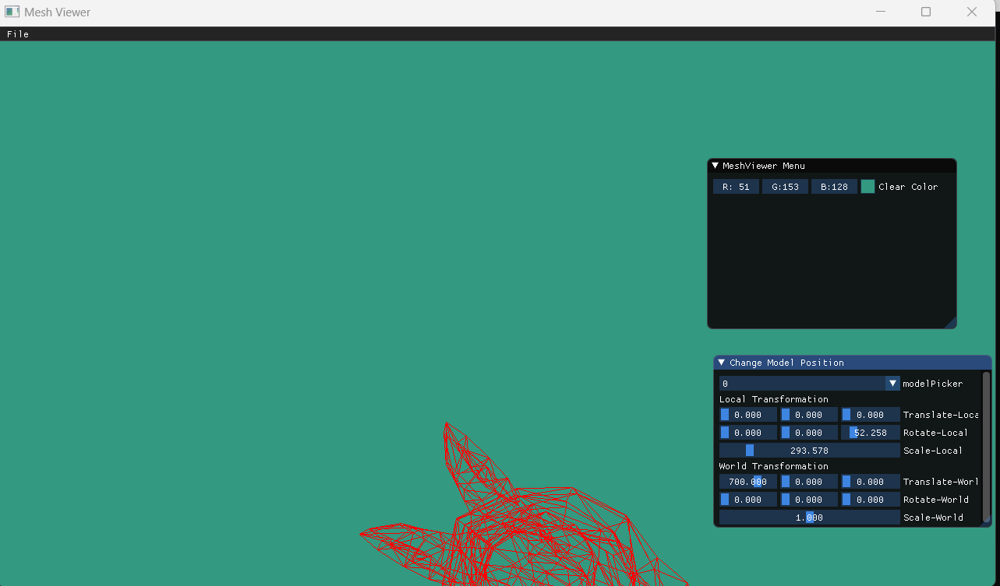

## Output the vertices:

```
by overloading the << method we printed the model's vertices:

std::ostream& operator<<(std::ostream &os, const std::shared_ptr<MeshModel>& myModel)
{
	os << "Vertices : " << std::endl;
	os << std::endl;
	
	for (int i = 0;i < myModel->GetVertices().size();i++)
	{
		os << "Vertice " << i << " : ";
		for (int j = 0;j < 3;j++)
			os << myModel->GetVertices()[i][j] << " ";
		os << std::endl;

	}
	os << std::endl;

	os << "Faces : " << std::endl;
	os << std::endl;


	for (int i = 0;i < myModel->GetFacesCount();i++)
	{
		os << "Face " << i << " : ";
		for (int j = 0;j < 3;j++)
			os << myModel->GetFace(i).GetVertexIndex(j) << " ";
		os << std::endl;

	}
	return os;
}
```


## Scale and Translate:

```
 We created a Gui to control and scale the object, and saved the transformation vectors.

		const int modelCount = scene.GetModelCount();
		static char* items[] = { "0","1","2","3","4","5","6","7"};
		static int selectedItem = modelCount;
		if (modelCount > 0)
		{
			ImGui::Begin("Change Model Position");
			ImGui::Combo("modelPicker", &selectedItem, items, modelCount);
			scene.SetActiveModelIndex(selectedItem);

			int index = scene.GetActiveModelIndex();
			MeshModel& myModel = scene.GetModel(index);

			 glm::vec3 translationObject(myModel.GetTranslationObject());
			 glm::vec3 rotationObject(myModel.GetRotationObject());
			 glm::vec3 scaleObject(myModel.GetScaleObject());

			 glm::vec3 translationWorld(myModel.GetTranslationWorld());
			 glm::vec3 rotationWorld(myModel.GetRotationWorld());
			 glm::vec3 scaleWorld(myModel.GetScaleWorld());


			ImGui::Text("Local Transformation");
			ImGui::SliderFloat3("Translate-Local", &translationObject.x, 0.0f, 1000.0f);
			ImGui::SliderFloat3("Rotate-Local", &rotationObject.x, 0.0f, 360.0f);
			ImGui::SliderFloat("Scale-Local", &scaleObject.x, 0.0f, 2000.0f);
			scaleObject.y = scaleObject.x;
			scaleObject.z = scaleObject.x;
			myModel.SetTranslationObject(translationObject);
			myModel.SetRotationObject(rotationObject);
			myModel.SetScaleObject(scaleObject);
			myModel.SetObjectTransform();

			ImGui::Text("World Transformation");

			ImGui::SliderFloat3("Translate-World", &translationWorld.x, 0.0f, 1000.0f);
			ImGui::SliderFloat3("Rotate-World", &rotationWorld.x, 0.0f, 360.0f);
			ImGui::SliderFloat("Scale-World", &scaleWorld.x, 0.0f, 2.0f);
			scaleWorld.y = scaleWorld.x;
			scaleWorld.z = scaleWorld.x;
			myModel.SetTranslationWorld(translationWorld);
			myModel.SetRotationWorld(rotationWorld);
			myModel.SetScaleWorld(scaleWorld);
			myModel.SetWorldTransform();
		}


		ImGui::End();

 ```

## Draw the model:

```
void Renderer::drawModel( MeshModel& myModel)
{
	glm::mat4 Transformation = myModel.GetTransform();

	for (int i = 0;i < myModel.GetFacesCount();i++)
	{
		glm::vec4 vertice0 = Transformation * glm::vec4(myModel.GetVertices()[myModel.GetFace(i).GetVertexIndex(0)-1],1);
		glm::vec4 vertice1 = Transformation * glm::vec4(myModel.GetVertices()[myModel.GetFace(i).GetVertexIndex(1)-1],1);
		glm::vec4 vertice2 = Transformation * glm::vec4(myModel.GetVertices()[myModel.GetFace(i).GetVertexIndex(2)-1],1);

		const glm::vec3 color = glm::vec3(1, 0, 0);
		DrawLine(vertice0, vertice1, color);
		DrawLine(vertice0, vertice2, color);
		DrawLine(vertice2, vertice1, color);

	}
}


void Renderer::Render( Scene& scene)
{
	
	int half_width = viewport_width / 2;
	int half_height = viewport_height / 2;
	if (scene.GetModelCount() > 0)
	{
		for (int i = 0;i < scene.GetModelCount();i++)
		{
			MeshModel myModel = scene.GetModel(i);
			drawModel(myModel);
		}
	}
}

```


## Gui design:

```
Each model contains 2 matrices : Object and World Transformation
Each transformation matrix contains vectors for : Translate, Rotate and Scale
Matrix transformation is : Translate X Rotate X Scale
The model transformation is : World Transformation X Object Transformation

```


## Using the Gui to control transformation:


```
Translate Object and then Rotating World
```


```
Translate World and then Rotating Object
```


## loading and transforming several models, each model independently:


https://user-images.githubusercontent.com/101698622/203961785-b7fc99ad-a43e-4b2a-8a6c-6d73ca1fbf92.mp4


