## Paragraph 1:
We implemented an Orthographic projection that enables the user to control the view volume :

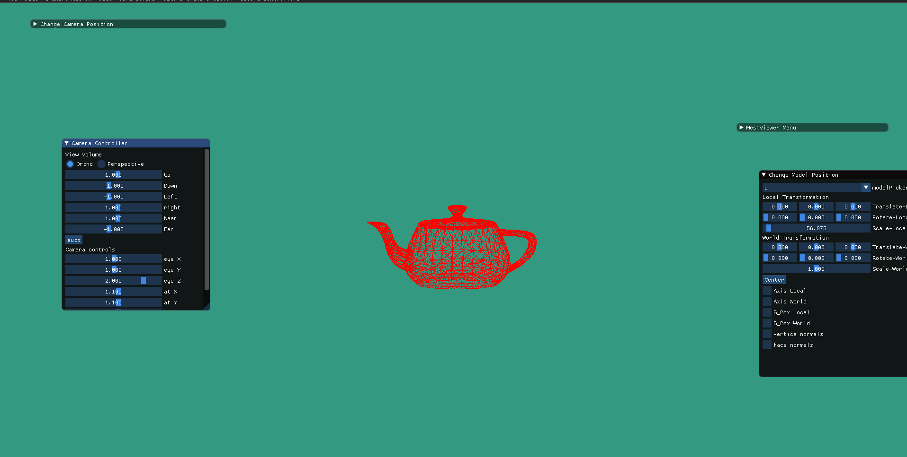
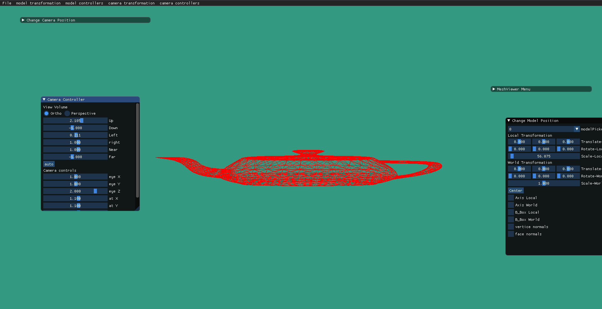

Video for demonstration :

https://user-images.githubusercontent.com/101698622/208249500-6205efa4-c490-4b42-a488-8a7b03e60807.mp4

## Paragraph 2:

Reposition the camera in camera frame and in world frame :

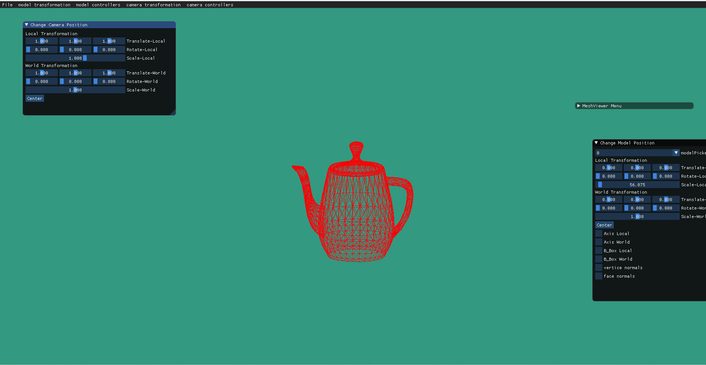

video for demostration :

https://user-images.githubusercontent.com/101698622/208249833-c38ab71f-3ae5-444a-93d7-601f88741c8b.mp4

In order to reposition the camera in the camera frame and in the world frame we multiplied the following:
camera projection X inverse(camera local frame X camera world frame) X matrix transformation

## Paragraph 3:

allowing the user to resize the window's size and we will resize the viewport accordingly with a new aspect ratio:

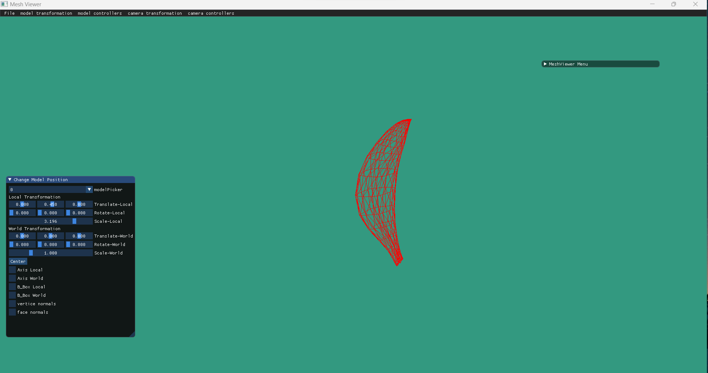
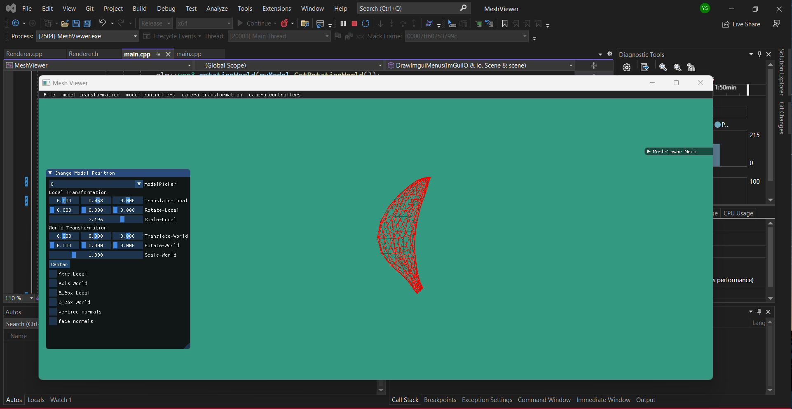
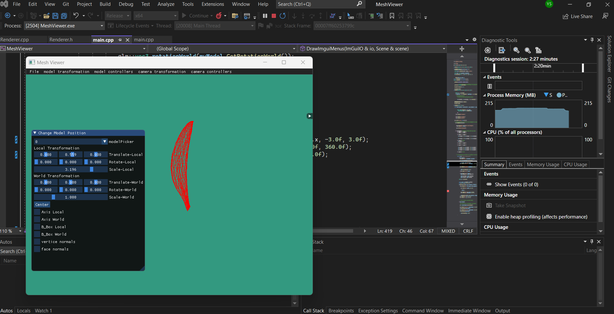

## Paragraph 4:

Axes drawing :

Translating and rotating on world frame: 
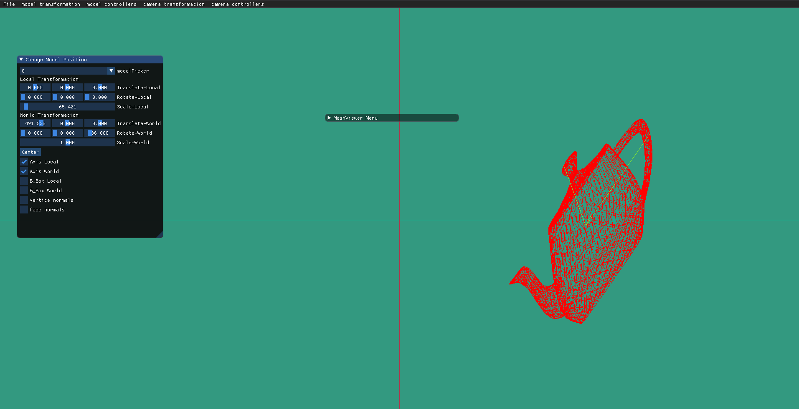
Translating in local frame and rotating in world frame:
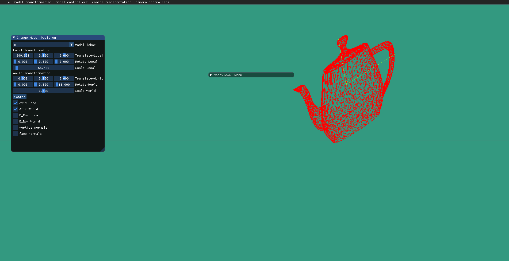
Translating and rotating on local frame: 
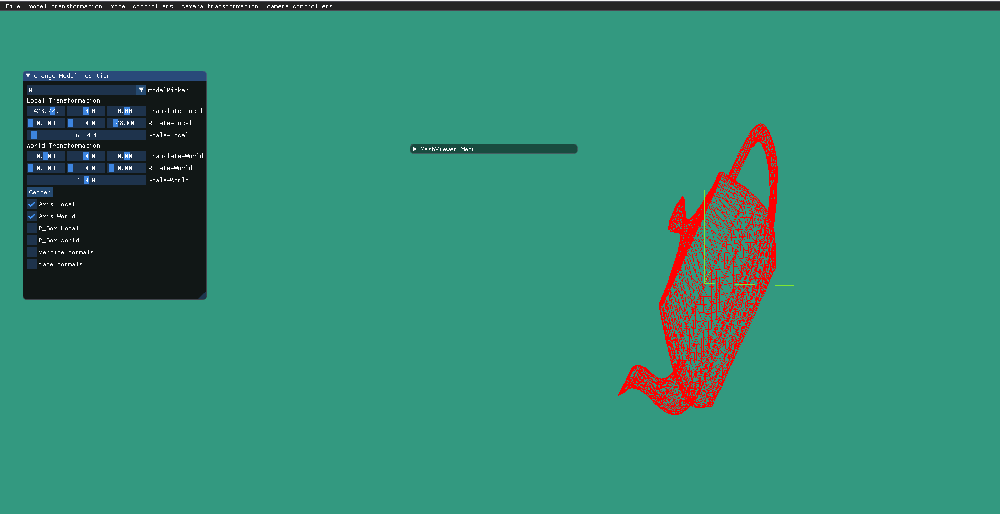

## Paragraph 5:
Applying T1 as a translate matrix with x = 0.889 and T2 as a rotation matrix with 209 degrees rotation relative to the Z axis.

T1 on model frame then T2 on world frame:

T1 on world frame then T2 on model frame:

We can see that the diffrence is that the order of multiplycation as well as the matrices applied to each of the frames makes a diffrence as T1,T2 are non commuting transformation.

## Paragraph 6:

Bounding Box Drawing :
The bounding box in the local frame is transforming together with the model,
while the bounding box in the world frame is always parallel to the World Axis.
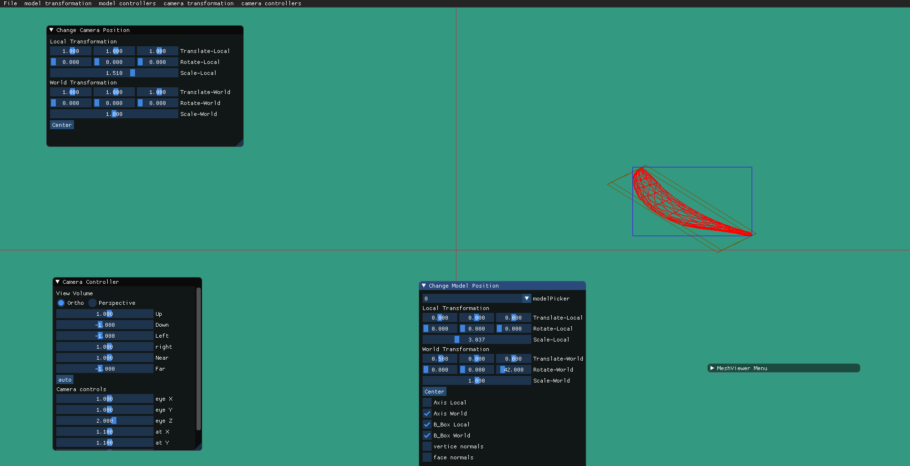

## Paragraph 7:

We can see that translating and rotating doesn't affect the vertices.
with a cube it is clear to see that the normals are perpendicular to the faces.
Vertex Normals
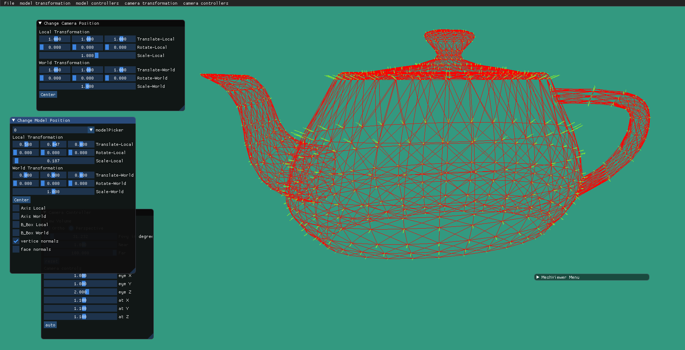
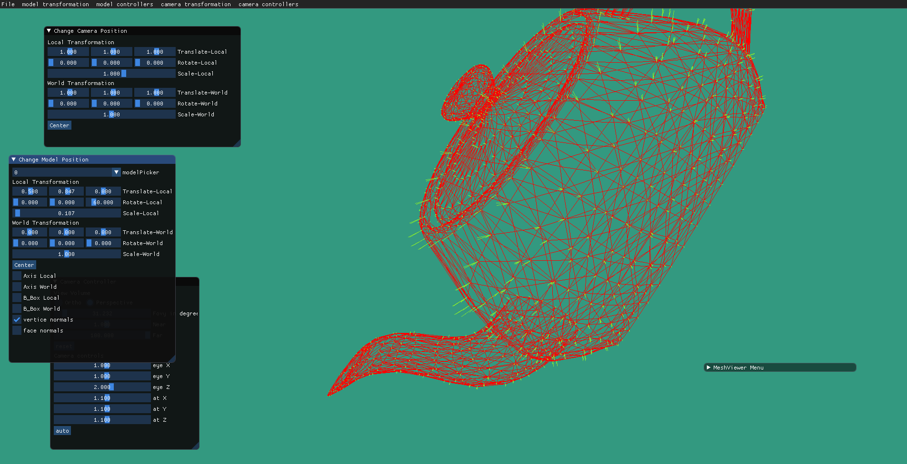

Face Normals

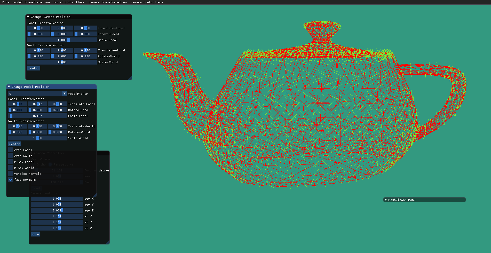
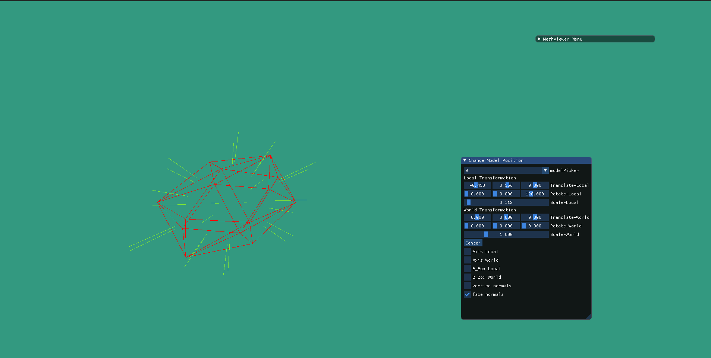

## Paragraph 8:

Orthographic projection compared to perspective projection.
As a sanity check we moved on the camera's Z axis, and it is clear to see that on perspective projection the object looks farther campared to the orthographic projection.
Orthographic:

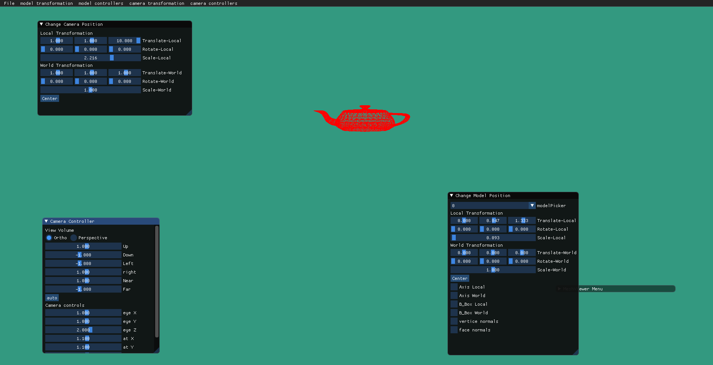
Perspective:

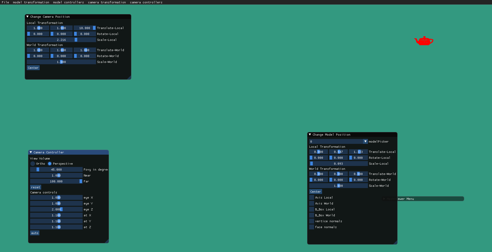

## Paragraph 9 video:

https://user-images.githubusercontent.com/108798956/208097507-5016801e-be26-46bf-a712-faf5f0cd8fc2.mp4

## Paragraph 10 screenshot:

## Paragraph 11 video - Dolly zoom:
### Manipulating the camera's FOV with it's movement on the Z asix causes  this "vertigo" effect.

https://user-images.githubusercontent.com/108798956/208257643-d1310f0e-23d8-4b6f-8c66-ad421ca21898.mp4

## Paragraph 12 - video of adding another camera to an existing one and 2 screenshots:

https://user-images.githubusercontent.com/108798956/208258205-0bab2172-133b-4102-9e6f-9413bb209ded.mp4

## Paragraph 13:

