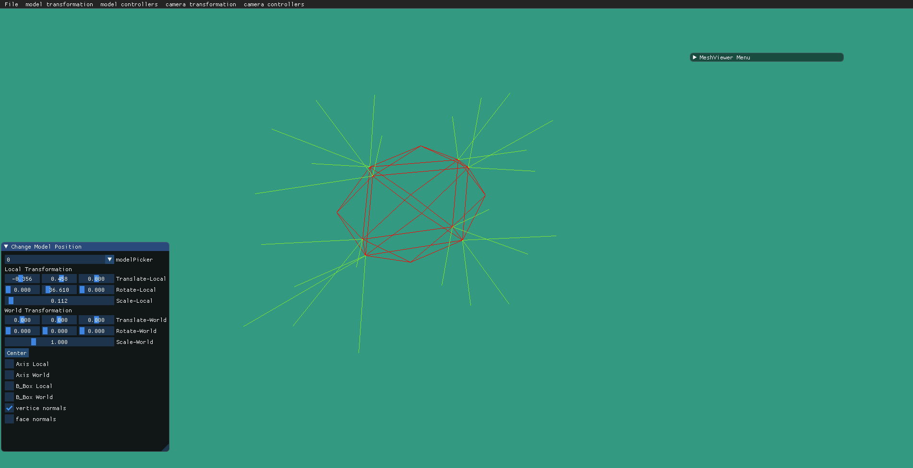
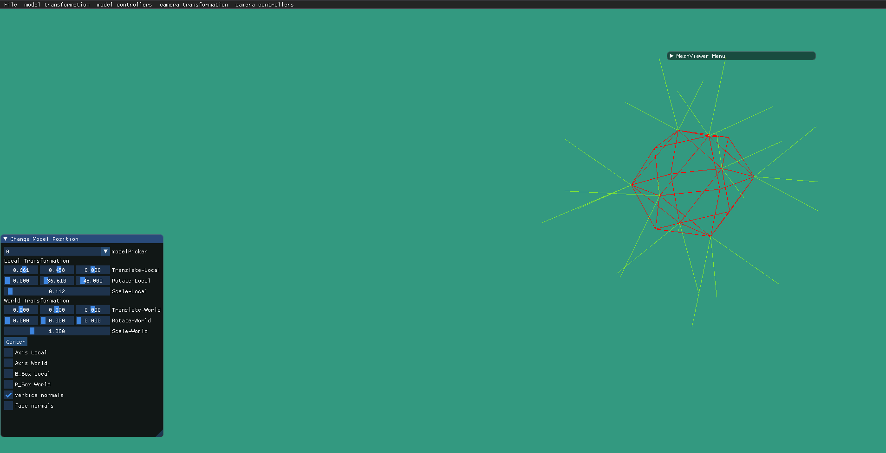
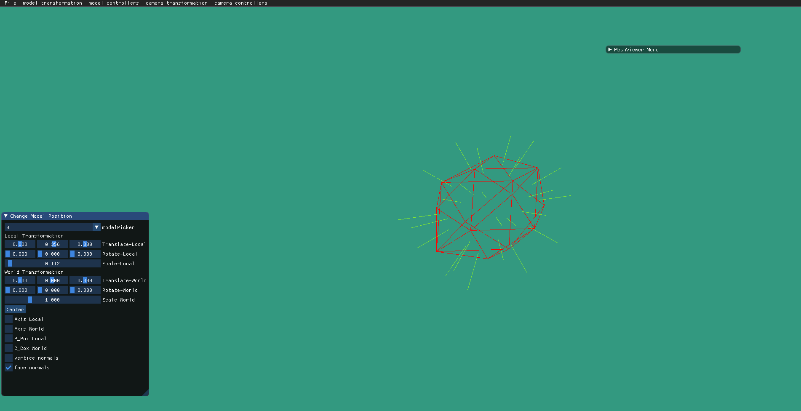

## Paragraph 1:
We implemented an Orthographic projection that enables the user to control the view volume :

Video for demonstration :

## Paragraph 2:

Reposition the camera in camera frame and in world frame :

video for demostration :

## Paragraph 3:

## Paragraph 4:

Axes drawing :

Translating and rotating on world frame: 

Translating in local frame and rotating in world frame:

Translating and rotating on local frame: 

## Paragraph 5:

## Paragraph 6:

Bounding Box Drawing :
The bounding box in the local frame is transforming together with the model,
while the bounding box in the world frame is always parallel to the World Axis.

## Paragraph 7:

Vertex Normals

Face Normals

## Paragraph 8:

Orthographic projection compared to perspective projection:
Orthographic:

perspective:

## Paragraph 9 video:

https://user-images.githubusercontent.com/108798956/208097507-5016801e-be26-46bf-a712-faf5f0cd8fc2.mp4

## Paragraph 10 screenshot:

